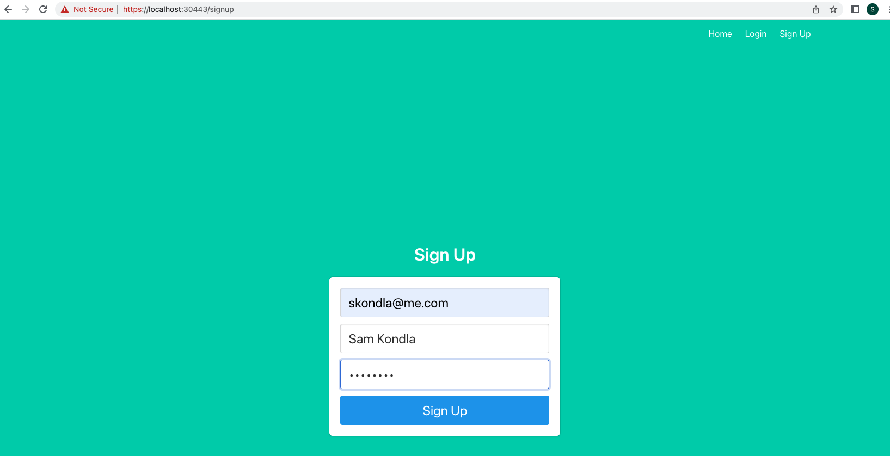
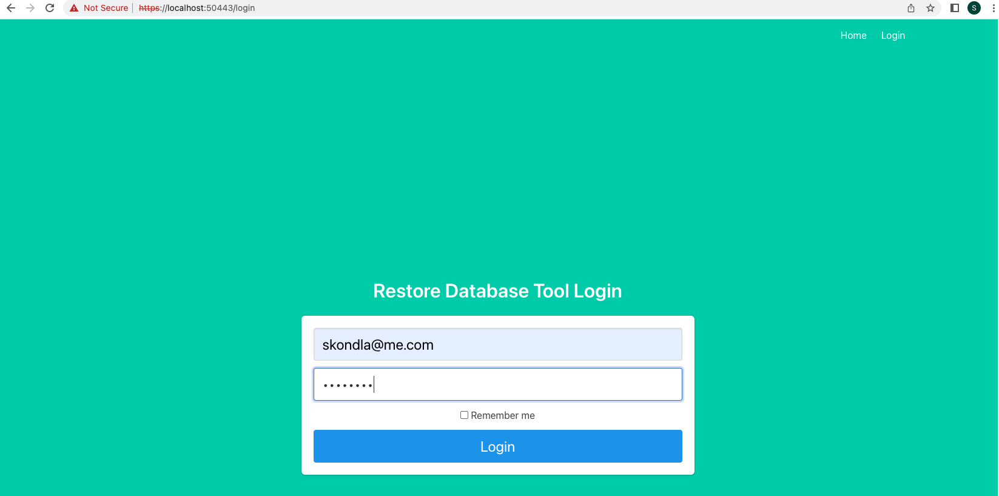
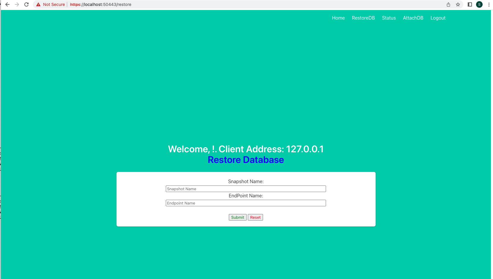
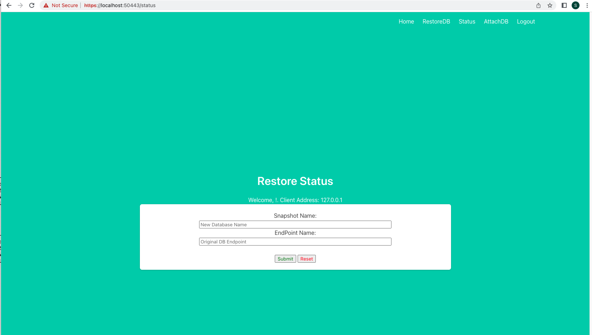
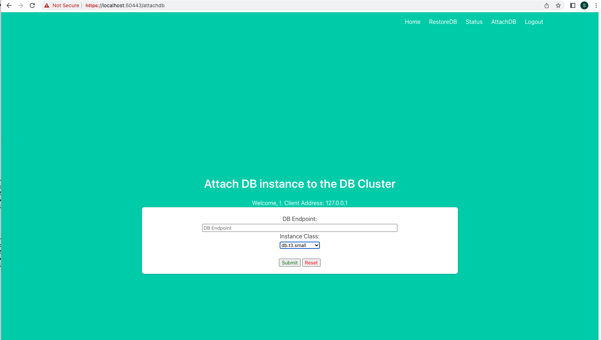
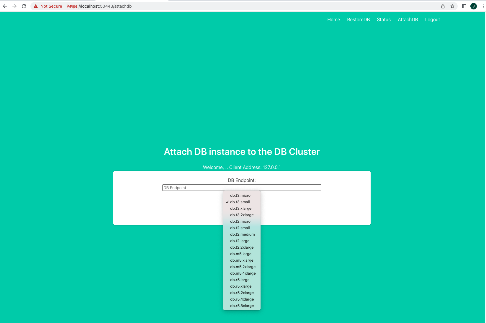
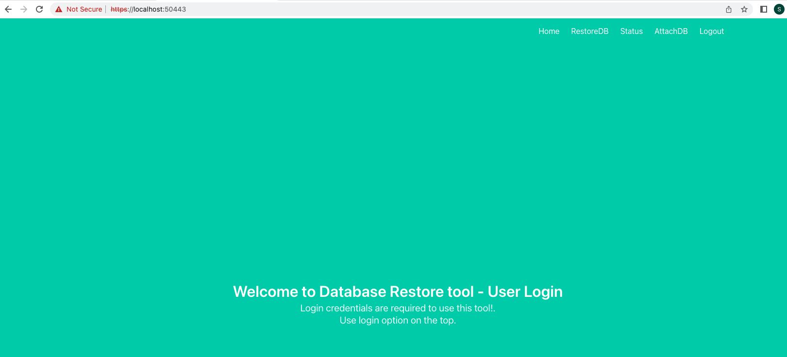
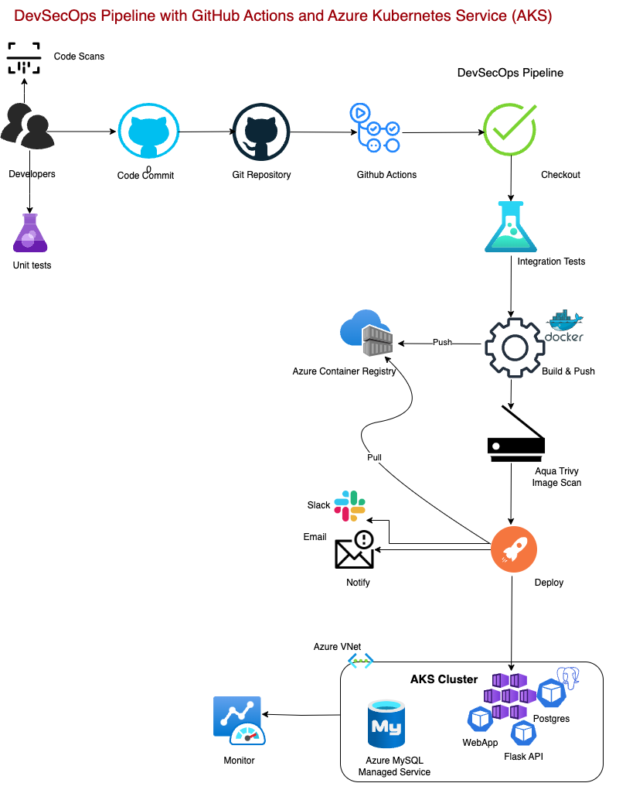
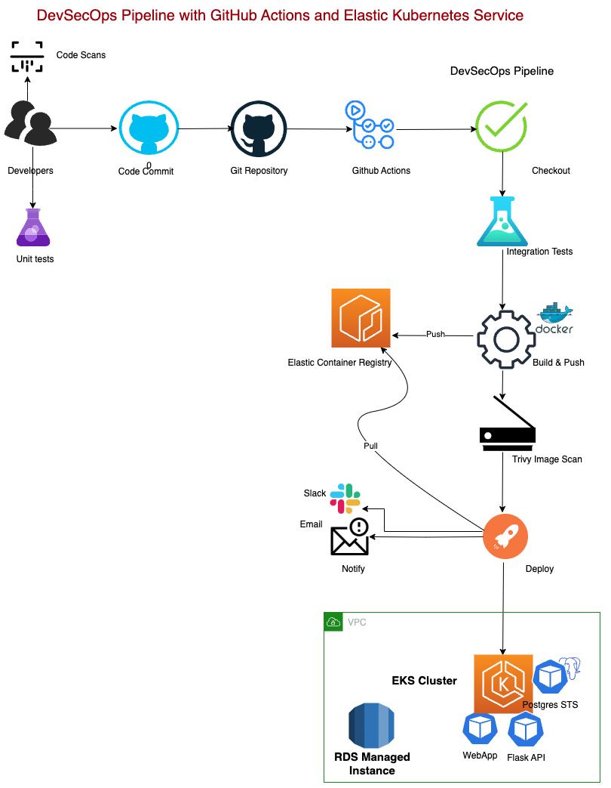
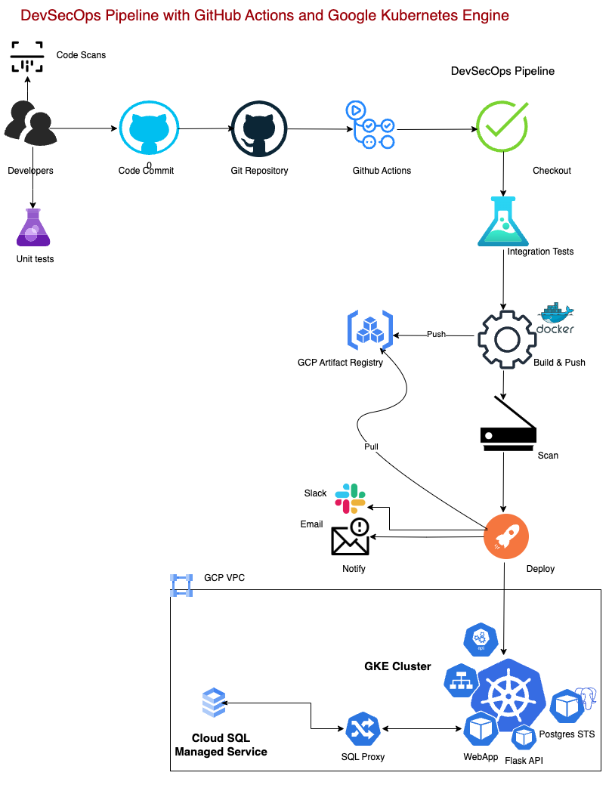

# fastAPIWebApp

[](https://github.com/skondla/flaskAPIWebApp/blob/main/LICENSE)
[](https://join.slack.com/t/devops-zwf1016/shared_invite/zt-1wsafgivm-iI88~ZqZBaKGzYhD8N2JsA)
[](https://github.com/skondla/flaskAPIWebApp/actions)
[](https://github.com/skondla/flaskAPIWebApp/actions)
[](https://github.com/skondla/flaskAPIWebApp/actions)
[](https://github.com/skondla/flaskAPIWebApp/actions)
[](https://twitter.com/skondla)

A multi-cloud, containerized web application and REST API for managing AWS RDS database operations — including restore from snapshot, status monitoring, and cluster attachment. Deployed on Kubernetes (EKS, GKE) with a full DevSecOps pipeline via GitHub Actions and ArgoCD GitOps.

---

## Table of Contents

- [Overview](#overview)
- [Architecture](#architecture)
- [Technology Stack](#technology-stack)
- [Application Structure](#application-structure)
- [API Endpoints](#api-endpoints)
- [Database Schema](#database-schema)
- [Infrastructure](#infrastructure)
- [CI/CD Pipeline](#cicd-pipeline)
- [Getting Started](#getting-started)
- [Usage — cURL Examples](#usage--curl-examples)
- [Screenshots](#screenshots)
- [DevSecOps Pipeline Diagrams](#devsecops-pipeline-diagrams)
- [Contact](#contact)

---

## Overview

The application exposes both a web interface (HTML/Jinja2) and a REST API for the following AWS RDS operations:

1. **Restore** — Restore an AWS RDS instance or Aurora cluster from a snapshot.
2. **Status** — Check the restore progress of a database instance or cluster.
3. **Attach DB** — Attach a new instance to an existing Aurora DB cluster.
4. **Authentication** — JWT-based login/signup with bcrypt password hashing.
5. **Audit Logging** — Every user action is recorded (email, IP, timestamp, endpoint, request type).

Authentication is required for all database operations. User signup is restricted to Admin console users only.

---

## Architecture

```
┌──────────────────────────────────────────────────────────────────────────┐
│                          Client (Browser / cURL)                         │
└──────────────────┬───────────────────────────────┬───────────────────────┘
                   │ HTTPS :50443 / :20443          │ HTTPS :30443 / :17344
                   ▼                                ▼
       ┌───────────────────────┐       ┌────────────────────────┐
       │    USER Application   │       │   ADMIN Application    │
       │  (FastAPI + Jinja2)   │       │  (FastAPI + Flask)     │
       │  Python 3.9 / Uvicorn │       │  Python 3.9 / mod_wsgi │
       │                       │       │                        │
       │  Routes:              │       │  Routes:               │
       │  /login  /signup      │       │  /auth/login           │
       │  /restore /status     │       │  /auth/signup          │
       │  /attachdb /logout    │       │  /main/profile         │
       └──────────┬────────────┘       └──────────┬─────────────┘
                  │                               │
                  └──────────────┬────────────────┘
                                 │
                  ┌──────────────▼────────────────┐
                  │     PostgreSQL Database        │
                  │  Tables: users, user_info      │
                  │  (Docker container / RDS)      │
                  └──────────────┬────────────────┘
                                 │
                  ┌──────────────▼────────────────┐
                  │         AWS Services           │
                  │  ┌─────────────────────────┐  │
                  │  │  RDS / Aurora           │  │
                  │  │  (Restore, Status,      │  │
                  │  │   Attach via boto3)     │  │
                  │  ├─────────────────────────┤  │
                  │  │  SES (Email alerts)     │  │
                  │  ├─────────────────────────┤  │
                  │  │  ECR (Container images) │  │
                  │  └─────────────────────────┘  │
                  └───────────────────────────────┘

─────────────────── Deployment Targets ─────────────────────

  ┌─────────────────────┐    ┌─────────────────────┐
  │  AWS EKS / ECS      │    │  GCP GKE            │
  │  (us-west-2)        │    │  (us-central1)      │
  │  Terraform modules  │    │  K8s manifests      │
  │  ALB, VPC, NAT GW   │    │  3-replica deploy   │
  └─────────────────────┘    └─────────────────────┘
            │                          │
            └──────────┬───────────────┘
                       │
          ┌────────────▼───────────────┐
          │  ArgoCD (GitOps)           │
          │  GitHub Actions (CI/CD)    │
          │  Trivy (Security scanning) │
          └────────────────────────────┘
```

### Component Interaction

```
GitHub Push
    │
    ▼
GitHub Actions
    ├── Trivy Vulnerability Scan (SARIF → GitHub Security)
    ├── Docker Build & Push → ECR / GCR
    └── Deploy → EKS  or  GKE
                    │
                    ▼
              ArgoCD (GitOps)
                    │
            ┌───────┴────────┐
            ▼                ▼
    K8s Deployment       K8s Service
    (admin-ui x3)        (user-ui)
    (user-ui  x3)        (admin-ui)
```

---

## Technology Stack

| Layer | ADMIN App | USER App |
|---|---|---|
| Language | Python 3.9 | Python 3.9 |
| Web Framework | Flask + FastAPI | FastAPI |
| ASGI/WSGI Server | mod_wsgi (httpd) | Uvicorn |
| Templating | Jinja2 | Jinja2 |
| Authentication | Flask-Login / JWT | fastapi-login (JWT) |
| Password Hashing | bcrypt (passlib) | bcrypt (passlib) |
| ORM | SQLAlchemy (async) | SQLAlchemy |
| Database | PostgreSQL (psycopg2) | PostgreSQL (psycopg2) |
| AWS SDK | boto3 / botocore | boto3 / botocore |
| HTTP Client | requests | requests |
| Testing | pytest 7.3.2 | pytest 7.3.2 |

| Infrastructure | Technology |
|---|---|
| Containerization | Docker (Python 3.9.13 base) |
| Orchestration | Kubernetes (EKS, GKE) |
| IaC | Terraform (modular, AWS) |
| CI/CD | GitHub Actions |
| GitOps | ArgoCD |
| Security Scanning | Trivy (CRITICAL severity) |
| Observability | Prometheus + Grafana (K8s operators) |
| Message Queue | RabbitMQ (K8s operator) |
| Cloud Providers | AWS (primary), GCP (secondary) |
| TLS | Self-signed certs (containers) / ACM (AWS ALB) |

---

## Application Structure

```
fastAPIWebApp/
├── dockerized/
│   ├── ADMIN/                    # Admin web application
│   │   ├── main.py               # FastAPI app, router includes, startup events
│   │   ├── auth.py               # Auth routes: /auth/login, /auth/signup
│   │   ├── models.py             # SQLAlchemy ORM: User, Userinfo
│   │   ├── database.py           # Async SQLAlchemy engine & session
│   │   ├── dependencies.py       # JWT auth dependency, password utils
│   │   ├── lib/
│   │   │   ├── rdsAdmin.py       # RDS operations (Describe, Create, Delete, Restore)
│   │   │   └── sesAdmin.py       # SES email notifications
│   │   ├── templates/            # Jinja2 HTML: login, signup, index, profile
│   │   ├── Dockerfile            # Python 3.9.13, self-signed TLS, port 30443
│   │   └── requirements.txt      # flask, fastapi, sqlalchemy, boto3, ...
│   │
│   ├── USER/                     # User web application
│   │   ├── main.py               # FastAPI app: /, /restore, /status, /attachdb
│   │   ├── auth.py               # Auth + DB operation routes (JWT via fastapi-login)
│   │   ├── models.py             # SQLAlchemy ORM: User, Userinfo
│   │   ├── database.py           # Database session config
│   │   ├── lib/
│   │   │   ├── rdsAdmin.py       # RDS: RDSDescribe, RDSCreate, RDSDelete, RDSRestore
│   │   │   └── sesAdmin.py       # SES email alerts
│   │   ├── templates/            # Jinja2 HTML: login, signup, restore, status, attachdb
│   │   ├── Dockerfile            # Python 3.9.13, self-signed TLS, port 50443
│   │   └── requirements.txt      # fastapi, uvicorn, sqlalchemy, boto3, passlib, ...
│   │
│   └── DB/
│       └── schema/
│           └── flaskapp.sql      # PostgreSQL schema: users + user_info tables
│
├── provisioning/
│   └── terraform/aws/web_infra/  # Modular Terraform for AWS
│       ├── main.tf               # Root module, provider config
│       ├── variables.tf          # Input variables
│       ├── outputs.tf            # Output values
│       └── modules/
│           ├── vpc/              # VPC + public/private subnets (us-west-2)
│           ├── nat_gateway/      # NAT gateway for private subnet egress
│           ├── security_groups/  # Inbound/outbound rules
│           ├── alb/              # Application Load Balancer
│           ├── ec2/app/          # App server EC2 instances
│           ├── ec2/bastion/      # Bastion host for SSH access
│           ├── route_tables/     # Route table associations
│           ├── subnets/          # Subnet definitions
│           ├── acm/              # AWS Certificate Manager (TLS)
│           └── vpc-endpoint-s3/  # S3 VPC endpoint (private subnet)
│
├── aws/
│   ├── ecr/                      # ECR repo setup/destroy scripts
│   ├── ecs/                      # ECS task definitions + IAM policies
│   ├── eks/                      # EKS cluster scripts + K8s manifests
│   └── web_infra/                # Additional AWS web infra scripts
│
├── gcp/
│   └── gke/deploy/manifests/flaskapp1/
│       ├── Deployment_admin_ui.yaml   # 3-replica admin deployment
│       ├── Deployment_user_ui.yaml    # User app deployment
│       ├── Service_admin_ui.yaml      # K8s service for admin
│       └── Service_user_ui.yaml       # K8s service for user
│
├── kubernetes/
│   └── operators/                # Grafana, Prometheus, RabbitMQ operators
│
├── argocd/                       # Helm-based ArgoCD install + ingress config
│
├── actions/
│   ├── Deploy-GKE.yml            # GKE DevSecOps pipeline (test → build → deploy)
│   ├── google.yml                # GCP-specific workflow
│   └── trivy-scan.yaml           # Trivy CRITICAL vulnerability scanning → SARIF
│
└── images/                       # Documentation screenshots
```

---

## API Endpoints

### USER Application (port `50443` / `20443`)

| Method | Endpoint | Auth | Description |
|---|---|---|---|
| `GET` | `/` | No | Landing page |
| `GET` | `/login` | No | Login form |
| `POST` | `/login` | No | Authenticate; returns JWT access token |
| `GET` | `/signup` | No | Signup form |
| `POST` | `/signup` | No | Create user account (bcrypt-hashed password) |
| `GET` | `/logout` | Yes | Clear auth cookie, redirect to `/` |
| `GET` | `/restore` | Yes | Restore DB form |
| `POST` | `/restore` | Yes | Restore RDS instance or Aurora cluster from snapshot |
| `GET` | `/status` | Yes | Status check form |
| `POST` | `/status` | Yes | Poll RDS restore status |
| `GET` | `/attachdb` | Yes | Attach DB form |
| `POST` | `/attachdb` | Yes | Create and attach instance to existing Aurora cluster |
| `POST` | `/log-user-info/` | Yes | Write audit log entry (email, IP, timestamp, endpoint) |

### ADMIN Application (port `30443` / `17344`)

| Method | Endpoint | Auth | Description |
|---|---|---|---|
| `GET/POST` | `/auth/login` | No | Admin login |
| `GET/POST` | `/auth/signup` | No | Admin user registration |
| `GET` | `/main/profile` | Yes | Authenticated user profile page |
| `GET` | `/` | No | Root — welcome message |

---

## Database Schema

PostgreSQL, managed via SQLAlchemy ORM. The `flaskapp.sql` bootstrap file creates:

```sql
-- Registered users
CREATE TABLE users (
    id       SERIAL PRIMARY KEY,
    email    VARCHAR(100) UNIQUE NOT NULL,
    password VARCHAR(1000) NOT NULL,   -- bcrypt hash
    name     VARCHAR(1000) NOT NULL
);

-- Audit / activity log
CREATE TABLE user_info (
    id          SERIAL PRIMARY KEY,
    email       VARCHAR(100) NOT NULL,
    ip          VARCHAR(50)  NOT NULL,  -- real IP via X-Forwarded-For
    time        VARCHAR(60)  NOT NULL,  -- YYYYMMDDHHmm
    requesttype VARCHAR(30),            -- GET / POST
    endpoint    VARCHAR(100),           -- e.g. /restore
    comments    VARCHAR(200)
);
```

---

## Infrastructure

### AWS — Terraform Modules (`provisioning/terraform/aws/web_infra/`)

| Module | Purpose |
|---|---|
| `vpc` | VPC + public & private subnets across AZs (us-west-2) |
| `nat_gateway` | NAT GW for private subnet internet egress |
| `security_groups` | ALB and app-tier security groups |
| `alb` | Application Load Balancer (HTTPS listener, target groups) |
| `acm` | TLS certificate via AWS Certificate Manager |
| `ec2/app` | Application EC2 instances in private subnet |
| `ec2/bastion` | Bastion host in public subnet for SSH tunneling |
| `route_tables` | Route table associations for public/private subnets |
| `subnets` | Subnet CIDR definitions |
| `vpc-endpoint-s3` | S3 VPC endpoint for private subnet connectivity |

### AWS Container Deployments

- **ECR** — Private container registry for Docker images.
- **ECS** — Fargate task definitions + IAM execution roles.
- **EKS** — Managed Kubernetes; cluster creation/teardown via bash scripts in `aws/eks/`.

### GCP — GKE (`gcp/gke/`)

- Kubernetes manifests for Admin (3 replicas) and User (configurable) deployments.
- `flaskapp1.yaml` — combined manifest.
- LoadBalancer services expose apps externally.

### Kubernetes Operators (`kubernetes/operators/`)

| Operator | Purpose |
|---|---|
| Prometheus | Metrics collection |
| Grafana | Metrics dashboards |
| RabbitMQ | Message queue (for async RDS operations) |

### ArgoCD GitOps (`argocd/`)

- Helm-based ArgoCD installation scripts.
- Ingress configuration for ArgoCD UI.
- Enables automated sync from Git to cluster state.

---

## CI/CD Pipeline

### GitHub Actions Workflows (`actions/`)

#### `Deploy-GKE.yml` — GKE DevSecOps Pipeline

Triggers on push to `testing_on_gcp` or `master` branches.

```
Push to branch
    │
    ├── [Test]      Run pytest unit tests
    ├── [Scan]      Trivy filesystem scan (CRITICAL) → SARIF upload
    ├── [Build]     Docker build + push to GCR
    └── [Deploy]    kubectl apply → GKE (admin-ui + user-ui deployments)
```

#### `Deploy-EKS-ADMIN.yml` / `Deploy-EKS-USER.yml` — EKS Pipelines

Similar stages targeting AWS EKS with ECR as the image registry.

#### `trivy-scan.yaml` — Standalone Security Scan

- Trivy filesystem vulnerability scanning on every PR.
- Severity filter: `CRITICAL`.
- Results uploaded as SARIF to GitHub Security tab.

---

## Getting Started

### Prerequisites

- Docker & Docker Compose
- Python 3.9+
- AWS credentials configured (`~/.aws/credentials` or environment variables)
- PostgreSQL (or use the included DB container)

### Run with Docker

```bash
# Build and start all services (USER app, ADMIN app, PostgreSQL)
cd dockerized

# USER app (HTTPS on port 50443)
docker build -t fastapi-user ./USER
docker run -p 50443:50443 --env-file USER/env.sh fastapi-user

# ADMIN app (HTTPS on port 30443)
docker build -t flask-admin ./ADMIN
docker run -p 30443:30443 --env-file ADMIN/env.sh flask-admin
```

### Environment Variables

Both apps expect these variables (see `env.sh` in each app directory):

```bash
DB_HOST=<postgres-host>
DB_PORT=5432
DB_NAME=flaskapp
DB_USER=<db-user>
DB_PASSWORD=<db-password>
AWS_DEFAULT_REGION=us-east-1
AWS_ACCESS_KEY_ID=<key>
AWS_SECRET_ACCESS_KEY=<secret>
SECRET_KEY=<jwt-secret>
```

### Initialize the Database

```bash
psql -h <host> -U <user> -d flaskapp -f dockerized/DB/schema/flaskapp.sql
```

---

## Usage — cURL Examples

### Restore a DB from Snapshot

```bash
#!/bin/bash
# Restore RDS instance from snapshot

snapshotname=${1}   # e.g. my-snapshot-name
endpoint=${2}       # e.g. myDB.cluster-XXXYYY.us-east-1.rds.amazonaws.com

EMAIL=$(cat ~/.password/mySecrets2 | grep email | awk '{print $2}')
PASSWORD=$(cat ~/.password/mySecrets2 | grep password | awk '{print $2}')

# Login (stores JWT cookie)
curl -k "https://192.168.2.15:50443/login" \
    --data-urlencode "email=${EMAIL}" \
    --data-urlencode "password=${PASSWORD}" \
    --cookie-jar cookies.txt --verbose > login_log.html

# Trigger restore
curl -k "https://192.168.2.15:50443/restore" \
    --data-urlencode "snapshotname=${snapshotname}" \
    --data-urlencode "endpoint=${endpoint}" \
    --cookie cookies.txt --cookie-jar cookies.txt --verbose
    echo

rm -f cookies.txt
```

### Check Restore Status

```bash
#!/bin/bash
snapshotname=${1}
endpoint=${2}

EMAIL=$(cat ~/.password/mySecrets2 | grep email | awk '{print $2}')
PASSWORD=$(cat ~/.password/mySecrets2 | grep password | awk '{print $2}')

curl -k "https://192.168.2.15:50443/login" \
    --data-urlencode "email=${EMAIL}" \
    --data-urlencode "password=${PASSWORD}" \
    --cookie-jar cookies.txt --verbose > login_log.html

curl -k "https://192.168.2.15:50443/status" \
    --data-urlencode "snapshotname=${snapshotname}" \
    --data-urlencode "endpoint=${endpoint}" \
    --cookie cookies.txt --cookie-jar cookies.txt --verbose
    echo

rm -f cookies.txt
```

### Attach DB Instance to Cluster

```bash
#!/bin/bash
endpoint=${1}       # e.g. myDB.cluster-XXXYYY.us-east-1.rds.amazonaws.com
instanceclass=${2}  # e.g. db.t3.medium

EMAIL=$(cat ~/.password/mySecrets2 | grep email | awk '{print $2}')
PASSWORD=$(cat ~/.password/mySecrets2 | grep password | awk '{print $2}')

curl -k "https://192.168.2.15:50443/login" \
    --data-urlencode "email=${EMAIL}" \
    --data-urlencode "password=${PASSWORD}" \
    --cookie-jar cookies.txt --verbose > login_log.html

curl -k "https://192.168.2.15:50443/attachdb" \
    --data-urlencode "endpoint=${endpoint}" \
    --data-urlencode "instanceclass=${instanceclass}" \
    --cookie cookies.txt --cookie-jar cookies.txt --verbose
    echo

rm -f cookies.txt
```

---

## Screenshots

Sign Up page:



Sign In page:



RestoreDB page:



RestoreDB Status page:



AttachDB page 1:



AttachDB page 2:



DB Restore Options after login:



---

## DevSecOps Pipeline Diagrams

### AKS (Azure Kubernetes Service)


### EKS (AWS Elastic Kubernetes Service)


### GKE (Google Kubernetes Engine)


---

## Contact

###### skondla.ai@gmail.com

###### DevSecOps Blog Posts

[DevSecOps — Deploying WebApp on Azure AKS cluster with Github Actions](https://kondlawork.medium.com/devsecops-deploying-webapp-on-azure-aks-cluster-with-github-actions-efc72bdc552a)

[DevSecOps — Deploying WebApp on AWS EKS cluster with Github Actions](https://kondlawork.medium.com/devsecops-deploying-webapp-on-aws-eks-cluster-with-github-actions-da8865a1b27)

[DevSecOps — Deploying WebApp on Google Cloud GKE cluster with Github Actions](https://medium.com/@kondlawork/devsecops-deploying-webapp-on-google-cloud-gke-cluster-with-github-actions-1028c0630dde)
