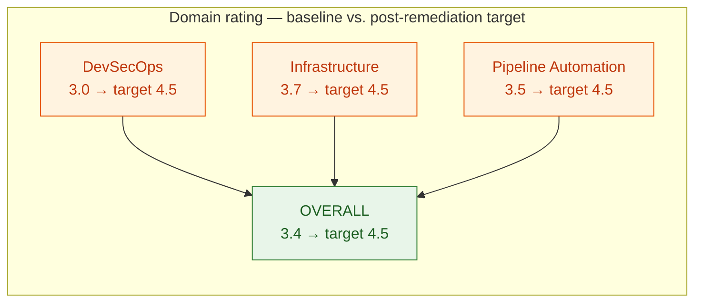
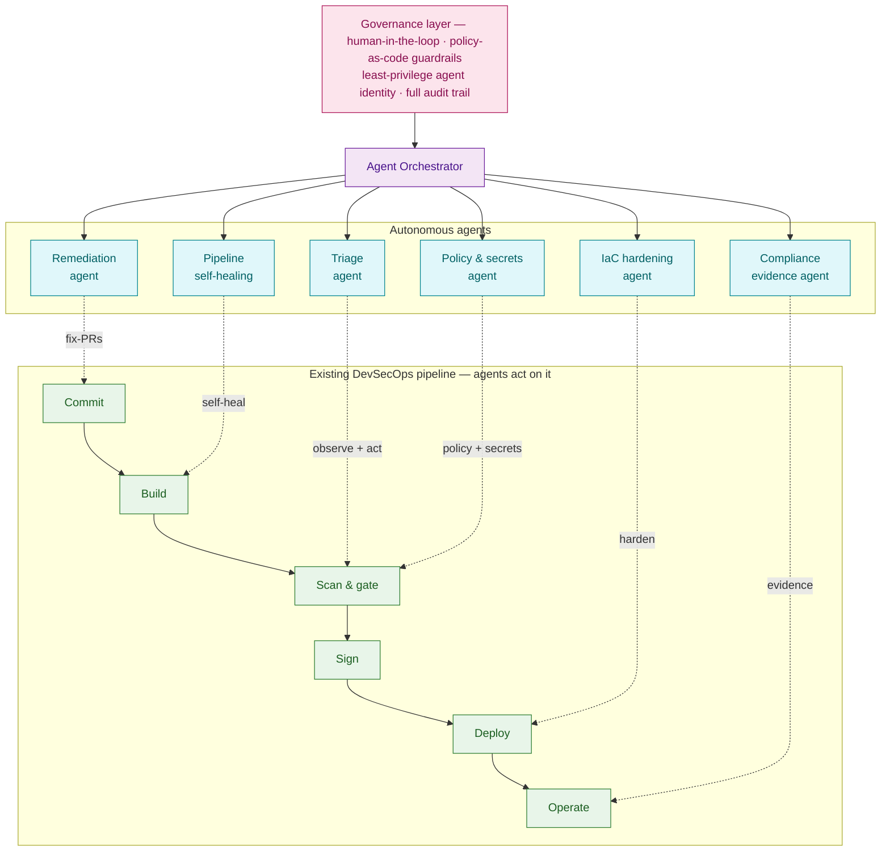

# Repository Quality Rating & Agentic AI Transformation

An evidence-based quality rating of **`skondla/fastAPIWebApp`** across DevSecOps,
infrastructure, and pipeline automation — and a roadmap to transform it with
**Agentic AI**: a system of goal-driven agents that observe, decide, and act
within guardrails to make enforcement, remediation, and hardening *continuous*
rather than aspirational.

> **Reading note.** The scorecard below is the **assessed baseline** that
> motivated the hardening work. Several "what holds it back" items have already
> been closed on the [`security/devsecops-gap-remediation`](../SECURITY.md)
> branch (blocking gates, image signing + SBOM, External Secrets, NetworkPolicy,
> read-only root filesystem, single delivery model, concurrency guards). Those
> are marked **✅ closed** throughout so the report reflects both where the repo
> was rated *and* where it now stands.

---

## Table of Contents

- [How quality is rated](#how-quality-is-rated)
- [Quality scorecard](#quality-scorecard)
- [Domain ratings](#domain-ratings)
- [Where the repository stands](#where-the-repository-stands)
- [The Agentic AI opportunity](#the-agentic-ai-opportunity)
- [Target architecture — agent-augmented pipeline](#target-architecture--agent-augmented-pipeline)
- [Six agents to deploy](#six-agents-to-deploy)
- [Transformation roadmap](#transformation-roadmap)
- [Projected impact](#projected-impact)
- [Guardrails — operating agents safely](#guardrails--operating-agents-safely)
- [Recommendations & next steps](#recommendations--next-steps)

---

## How quality is rated

Three domains, each scored **1–5** against observed evidence in the repository —
the same maturity ladder applied consistently.

| Level | Name | Meaning |
|:---:|---|---|
| 1 | Initial | Ad hoc, undocumented |
| 2 | Developing | Present but inconsistent |
| 3 | Defined | Standardised and repeatable |
| 4 | Managed | Measured and enforced |
| 5 | Optimised | Continuously improving |

**What each domain measures**

- **DevSecOps** — scan coverage, gate enforcement, secrets handling, supply-chain integrity, cloud authentication.
- **Infrastructure** — IaC quality, multi-cloud parity, Kubernetes runtime hardening, network policy, observability.
- **Pipeline automation** — stage design, orchestration, keyless auth, triggers, and the clarity of the delivery model.

---

## Quality scorecard

| Domain | Assessed rating | Maturity | Headline |
|---|:---:|---|---|
| **DevSecOps** | 3.0 / 5 | Defined | Broad scanning, but gates did not enforce |
| **Infrastructure** | 3.7 / 5 | Defined → Managed | Strong multi-cloud IaC and runtime hardening |
| **Pipeline automation** | 3.5 / 5 | Defined → Managed | Well-orchestrated, yet non-blocking and dual-model |
| **Overall** | **3.4 / 5** | **Defined** | A well-built reference repository |

> *The craft is real: broad scanning, modular multi-cloud IaC, and a hardened
> runtime. The ceiling was enforcement — scanners that reported without blocking,
> an ambiguous delivery model, and a thin supply chain. Those are exactly the
> repetitive, high-volume problems Agentic AI is built to absorb.*

---

## Domain ratings

### DevSecOps — 3.0 / 5 (Defined)

| Criterion | Score | Status after remediation |
|---|:---:|---|
| Security scan coverage | 4 / 5 | maintained |
| Cloud authentication (OIDC) | 5 / 5 | maintained |
| Gate enforcement | 2 / 5 | ✅ closed — all gates now block on CRITICAL / high-confidence |
| Secrets management | 2 / 5 | ✅ closed — External Secrets Operator / Sealed Secrets |
| Supply-chain integrity | 1 / 5 | ✅ closed — cosign signing + CycloneDX SBOM + attestation |

**Lifted the score:** six scanners span the full lifecycle · keyless OIDC federation · SARIF centralised in one place.
**Held it back (now addressed):** non-blocking gates · plain base64 Secret · no signing/SBOM/provenance.

### Infrastructure — 3.7 / 5 (Defined → Managed)

| Criterion | Score | Status after remediation |
|---|:---:|---|
| IaC quality & modularity | 4 / 5 | maintained |
| Multi-cloud parity | 4 / 5 | maintained |
| Kubernetes runtime hardening | 4 / 5 | ✅ improved — read-only root filesystem added |
| Network segmentation | 3 / 5 | ✅ closed — default-deny NetworkPolicies |
| Secrets store | 2 / 5 | ✅ closed — managed store via External Secrets |
| Observability & monitoring | 4 / 5 | maintained |

### Pipeline automation — 3.5 / 5 (Defined → Managed)

| Criterion | Score | Status after remediation |
|---|:---:|---|
| Stage design & coverage | 4 / 5 | maintained |
| Orchestration & parallelism | 4 / 5 | maintained |
| Keyless authentication | 5 / 5 | maintained |
| Triggers & path filtering | 4 / 5 | maintained |
| Gate enforcement | 2 / 5 | ✅ closed — scanners now fail the build |
| Delivery-model clarity | 2 / 5 | ✅ closed — ArgoCD as single applier + concurrency guard |

---

## Where the repository stands

Strong engineering craft across all three domains — rated one full level below its
potential by a single theme: **automation that observed but did not enforce.**

> *Every domain lost points in the same place: the volume of findings,
> configuration checks, and pipeline events is larger than a team can triage and
> act on by hand, so gates were left open and fixes lagged. That is a
> **throughput problem.** The manual remediation switched enforcement on;
> Agentic AI keeps it on by absorbing the ongoing load.*

---

## The Agentic AI opportunity

Agentic AI is **not** a copilot that suggests — it is a system of goal-driven
agents that observe, decide, and act within guardrails. This repository's gaps
are precisely the kind of work agents absorb.

| Gap today | Agentic answer |
|---|---|
| **Findings outpace the team** — six scanners produce more findings than anyone can triage | Agents triage, deduplicate, and prioritise continuously |
| **Remediation is manual** — each CVE / misconfig / IaC gap is a hand-written fix | Agents open tested fix-PRs the moment an issue appears |
| **Hardening drifts** — NetworkPolicy, secrets, parity gaps persist with no steady-state owner | Agents watch desired state and propose corrections |
| **Enforcement feels risky** — blocking the build is feared when the backlog is unknown | Agents clear the backlog, making enforcement safe to keep on |

---

## Target architecture — agent-augmented pipeline

Agents sit **beside** the existing pipeline — never replacing it — coordinated by
an orchestrator and bounded by a human-oversight and policy layer.

*Agents observe pipeline events and cluster state, then act — opening PRs,
proposing policy, fixing runs — while every consequential change routes back
through the human-oversight layer.*

---

## Six agents to deploy

| Agent | What it does |
|---|---|
| **Security triage agent** | Consumes SARIF from all six scanners; deduplicates, ranks by exploitability and reachability, suppresses false positives, files only what matters. |
| **Remediation agent** | Opens tested fix-PRs for dependency CVEs and IaC misconfigurations — upgrades, patches, resolves breakage, runs the suite. |
| **Pipeline self-healing agent** | Diagnoses failed CI runs — flaky test, real break, or infra — then retries, quarantines, or proposes a fix automatically. |
| **IaC hardening agent** | Watches Terraform and manifests; proposes NetworkPolicy, read-only root filesystem, and secrets-store moves, keeping clouds in parity. |
| **Policy & secrets agent** | Generates policy-as-code from intent, drafts admission rules, and migrates plaintext secrets to a managed store. |
| **Compliance evidence agent** | Continuously assembles SBOMs, scan results, and attestations into audit-ready evidence mapped to a framework. |

> Several of these agents now have a concrete substrate to build on, created by
> the manual remediation: SARIF from blocking gates (triage), cosign + SBOM
> attestations (compliance evidence), Kyverno policies (policy & secrets), and
> NetworkPolicy / read-only-fs manifests (IaC hardening).

---

## Transformation roadmap

Autonomy is earned in stages — each phase widens what agents may do only after
the previous phase has proven safe.

```mermaid
flowchart LR
    classDef p1 fill:#FFF3E0,stroke:#E65100,color:#BF360C
    classDef p2 fill:#FFF8E1,stroke:#F57F17,color:#E65100
    classDef p3 fill:#E8F5E9,stroke:#2E7D32,color:#1B5E20

    subgraph PH1["Phase 1 · 0–2 months · Assistive"]
        direction TB
        X1["AI copilots in IDE + PR review"]:::p1
        X2["Triage agent ranks findings — humans act"]:::p1
        X3["Every change human-authored + approved"]:::p1
    end
    subgraph PH2["Phase 2 · 2–5 months · Supervised agents"]
        direction TB
        Y1["Agents open fix-PRs + propose IaC/policy"]:::p2
        Y2["Pipeline agent self-heals failed runs"]:::p2
        Y3["Humans review + approve every merge"]:::p2
    end
    subgraph PH3["Phase 3 · 5–10 months · Autonomous + guardrails"]
        direction TB
        Z1["Low-risk fixes auto-merge once tests + policy pass"]:::p3
        Z2["Gates enforce; backlog is agent-managed"]:::p3
        Z3["Humans handle exceptions + set policy only"]:::p3
    end
    PH1 --> PH2 --> PH3
```

---

## Projected impact

Indicative targets for an agent-augmented pipeline — *today* vs. the projected
steady state after Phase 2.

| Headline | Today | With agents |
|---|---|---|
| Vulnerability MTTR | days | hours |
| Findings auto-triaged | ~0% | ~90% |
| Gate enforcement | off → **on (already switched on manually)** | continuous |

| Metric (0–100) | Today | With agents |
|---|:---:|:---:|
| Finding triage throughput | 20 | 92 |
| Mean time to remediate | 25 | 85 |
| Pipeline fix turnaround | 30 | 88 |
| Security gate enforcement | 5 | 95 |
| Infrastructure drift closure | 35 | 90 |
| Audit-evidence readiness | 30 | 92 |

---

## Guardrails — operating agents safely

Autonomy without bounds is a new attack surface. Each agent runs inside controls
that make its actions reviewable, reversible, and constrained.

| Guardrail | Rule |
|---|---|
| **Human-in-the-loop** | Every high-risk action — merges, policy changes, production deploys — needs explicit human approval. |
| **Least-privilege identity** | Each agent has its own scoped, short-lived credential — never a shared, broad one. |
| **Agents cannot weaken security** | An agent may never disable a gate, lower a policy, or bypass a control — enforced by policy (Kyverno). |
| **Full audit trail** | Every observation, decision, and action is logged, attributable, and replayable. |
| **Prompt-injection defense** | Untrusted scan output and tickets are treated as data — never as instructions to the agent. |
| **Cost & rate limits** | Token budgets, action quotas, and circuit-breakers stop runaway loops before they spread. |

---

## Recommendations & next steps

Two tracks run in parallel: close the quality gaps by hand now, while standing up
the agents that will keep them closed.

| Now · weeks | Next · 1–3 months | Strategic · 3–10 months |
|---|---|---|
| ✅ Make scanners block on High/Critical | Deploy the triage agent on scanner output | Let low-risk fixes auto-merge under policy |
| ✅ Move secrets to a managed store | Add the remediation agent for CVEs + IaC | Add IaC-hardening + compliance-evidence agents |
| ✅ Choose one delivery model (ArgoCD) | Pilot the pipeline self-healing agent in CI | Track impact metrics; widen autonomy on evidence |
| ✅ Add image signing, SBOM, NetworkPolicy | Wire every agent into the guardrail layer | Re-rate the repository — target 4.5+ across domains |

> The **Now · weeks** column is complete (see [SECURITY.md](../SECURITY.md)). The
> remaining columns are the Agentic AI build-out.

### Five things to carry forward

1. **A well-built repository — rated 3.4 / 5.** Strong craft across all three domains, held back by enforcement, not engineering.
2. **Coverage is not protection.** Six scanners that cannot fail a build measure risk without reducing it — now fixed.
3. **The gaps are a throughput problem.** Findings, fixes, and drift outrun the team — exactly the load Agentic AI absorbs.
4. **Earn autonomy in phases.** Assistive → supervised → autonomous, each stage proven before the next.
5. **Guardrails are non-negotiable.** Human oversight, least privilege, and audit trails make agent autonomy safe to grant.

---

*Source: DevSecOps Quality Rating & Agentic AI Transformation analysis of
[github.com/skondla/fastAPIWebApp](https://github.com/skondla/fastAPIWebApp).
Baseline ratings reflect the pre-remediation state; ✅ items were closed in the
security hardening branch.*
