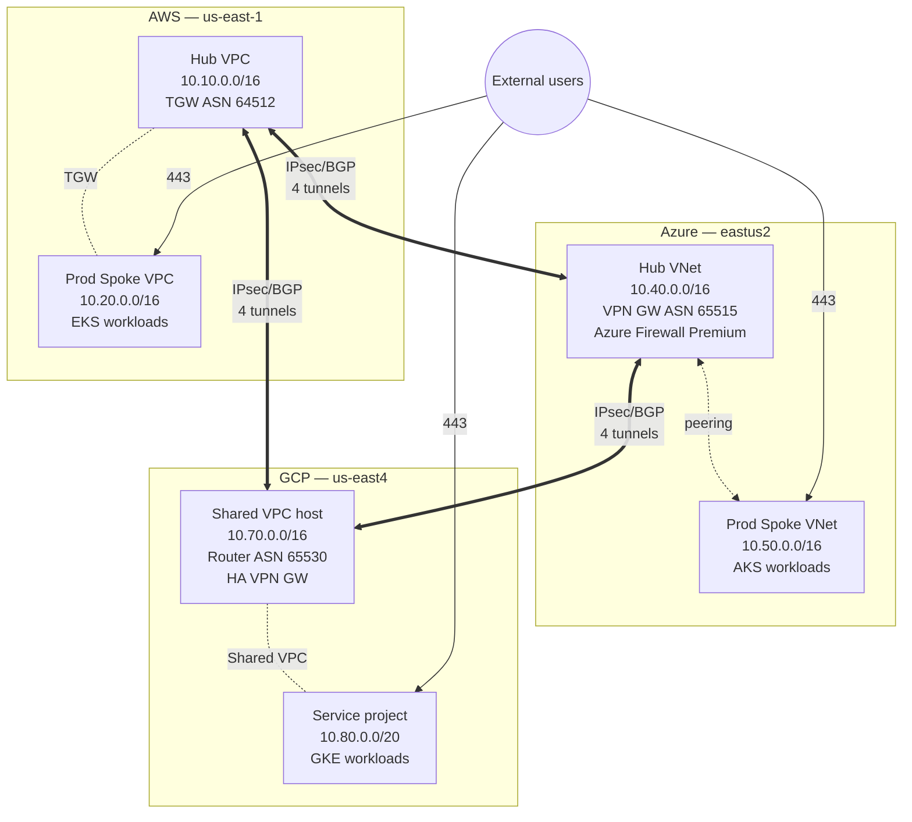
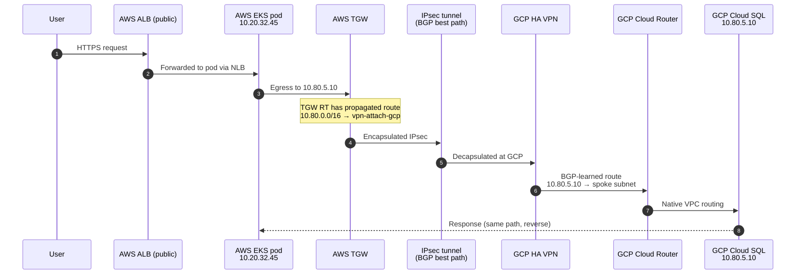
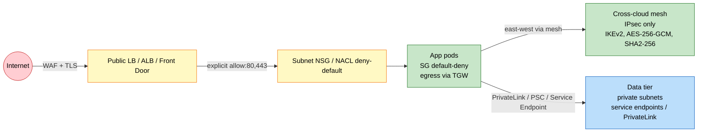
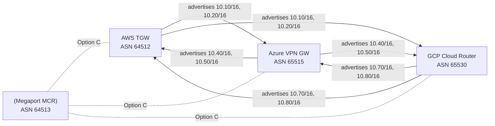
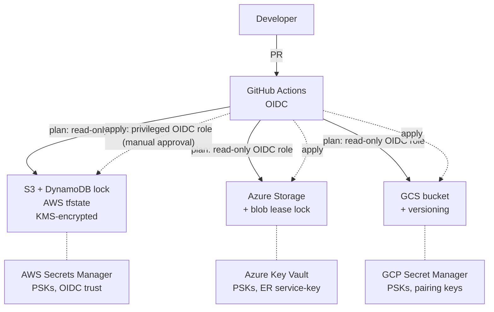

# Multi-cloud network architecture

This document is the source of truth for how AWS, Azure, and GCP environments
are wired together. The Mermaid diagrams below render directly on GitHub.

Diagrams included:

1. **Topology** — physical layout of hubs, spokes, and cross-cloud links.
2. **Traffic flow** — how a request from internet → app → cross-cloud DB
   actually moves.
3. **Security zones** — trust boundaries, NSG/SG enforcement points, egress
   inspection.
4. **BGP / ASN map** — which side originates what, which fail-over paths exist.
5. **State-and-secret topology** — where Terraform state lives, how PSKs flow.

---

## 1. Topology (default: full-mesh IPsec)

12 BGP-routed IPsec tunnels total (4 per leg, active-active). Each leg
survives the loss of either endpoint without traffic re-convergence.

---

## 2. Traffic flow — east-west request

User hits the AWS prod ALB; AWS prod EKS pod needs the central audit DB
hosted in GCP.

Failure mode: if one of the 4 tunnels in the leg goes down, BGP withdraws the
route and the remaining 3 carry the load with ~15-30s convergence.

---

## 3. Security zones

Enforcement points:
- **Internet → DMZ**: AWS WAF / Azure Front Door / GCP Cloud Armor; TLS terminate.
- **DMZ → app**: SG/NSG default-deny; explicit allow for healthcheck + app ports.
- **App → cross-cloud**: routes ONLY via TGW/VPN. No public egress from app
  subnets (NAT GW is in the public tier; private subnets do not get NAT).
- **App → data**: PaaS reached via PrivateLink (AWS), Private Endpoint (Azure),
  PSC (GCP). No public DB endpoints.

---

## 4. BGP / ASN map

Pod CIDRs (100.64.0.0/10) are **not** advertised across the mesh — pods reach
each other through node-IP NAT, not pod-IP routing.

---

## 5. State + secret topology

PSKs land in Terraform state (random_password). State backends are CMK-encrypted,
versioned, locked, and access-audited. Apply role requires manual approval in
GitHub deployment environments.
