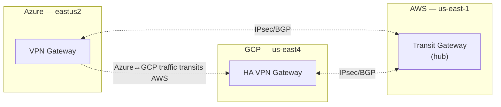
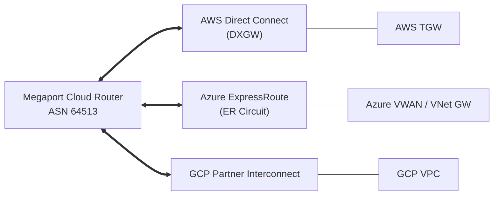
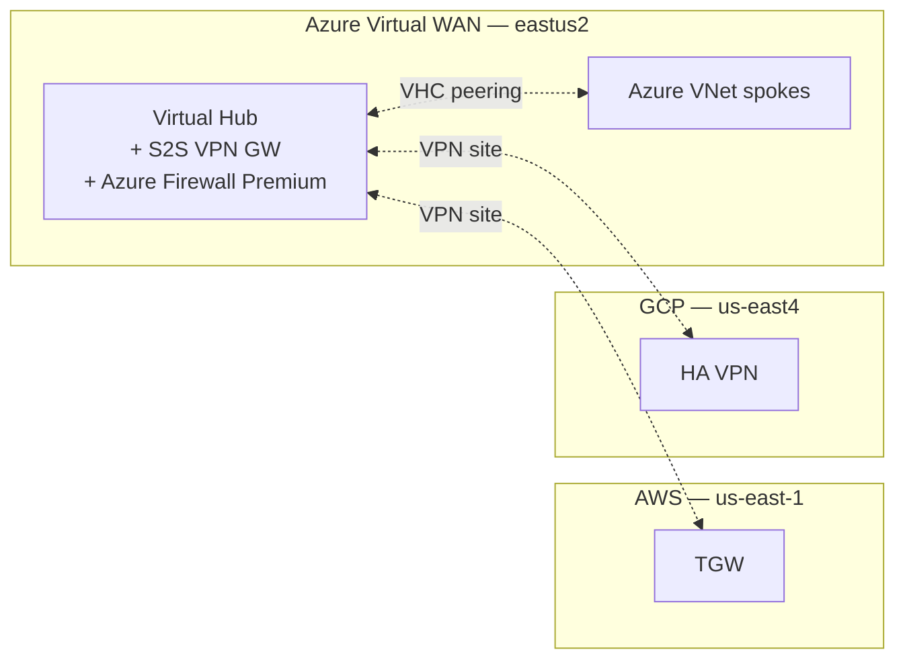

# Alternative multi-cloud topologies

Diagrams for the three alternative options in
`provisioning/terraform/envs/prod/cross-cloud-alternatives/`.

---

## Option A (default) — Full-mesh IPsec

Already documented in [multi-cloud-network.md](./multi-cloud-network.md).

---

## Option B — AWS TGW hub-and-spoke

8 tunnels total (4 per leg). No direct Azure↔GCP path.

---

## Option C — Megaport Cloud Router (SDN)

3 VXCs, no IPsec, 5-15ms cross-cloud latency, up to 10 Gbps per VXC.

---

## Option D — Azure Virtual WAN hub

Azure manages all branch-to-branch routing; in-hub firewall inspects every
packet without UDR plumbing.

---

## Picking between options

| If your priority is …            | Pick                                    |
|----------------------------------|-----------------------------------------|
| No vendor lock-in                | A (default mesh)                        |
| Lowest cost                      | B (AWS hub) — at the cost of HA         |
| Lowest latency / highest BW      | C (Megaport)                            |
| Managed routing service          | D (Azure VWAN) if Azure-centric         |
| HA across cloud-region failures  | A or C                                  |
